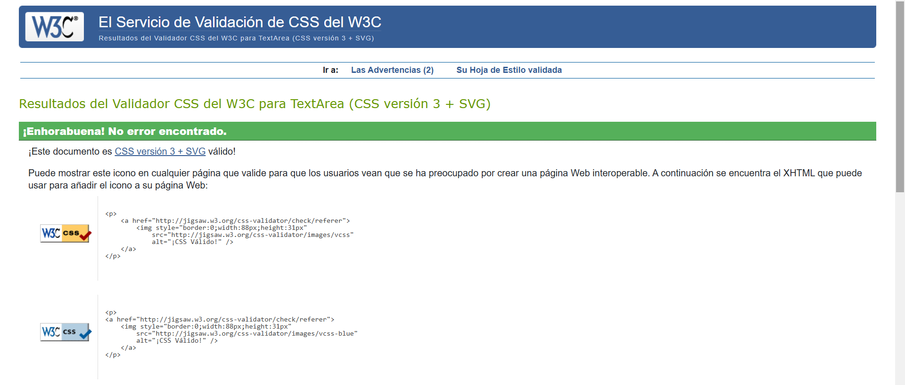
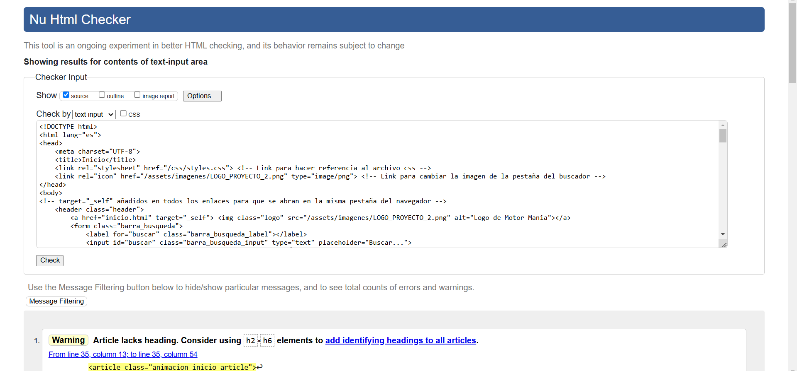
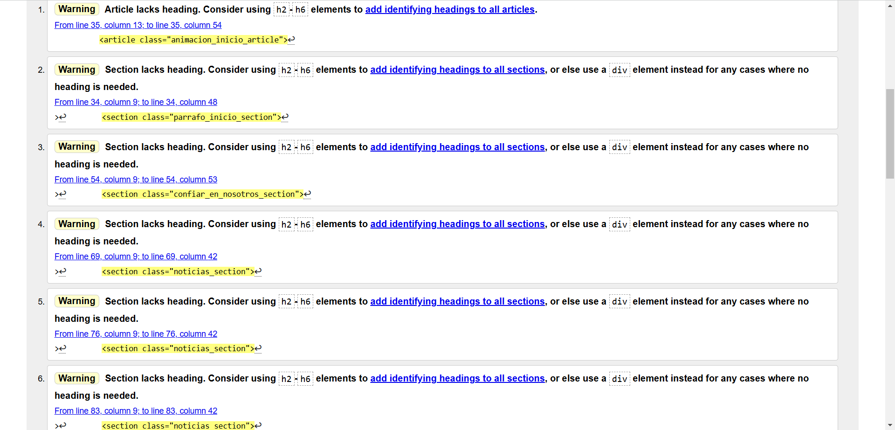
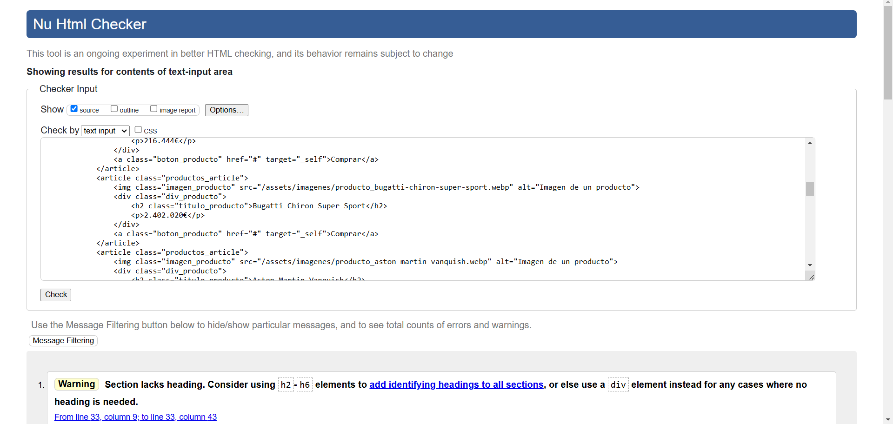
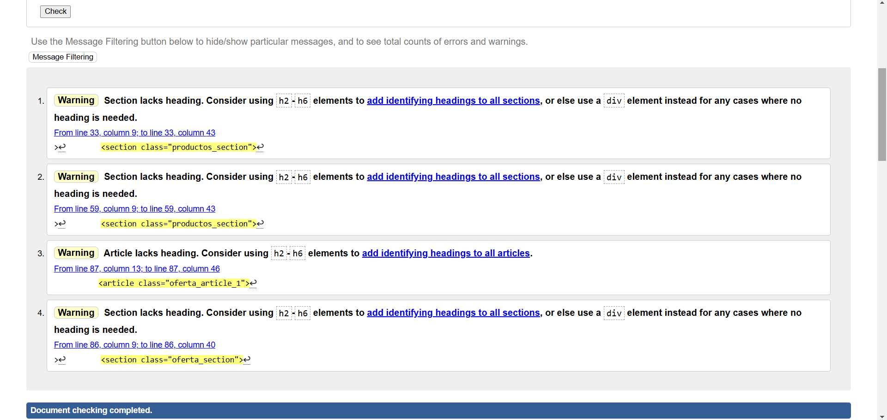
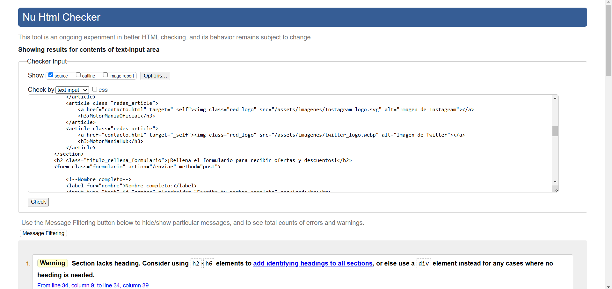
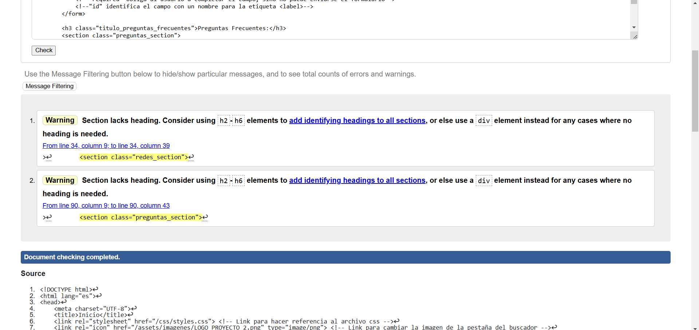
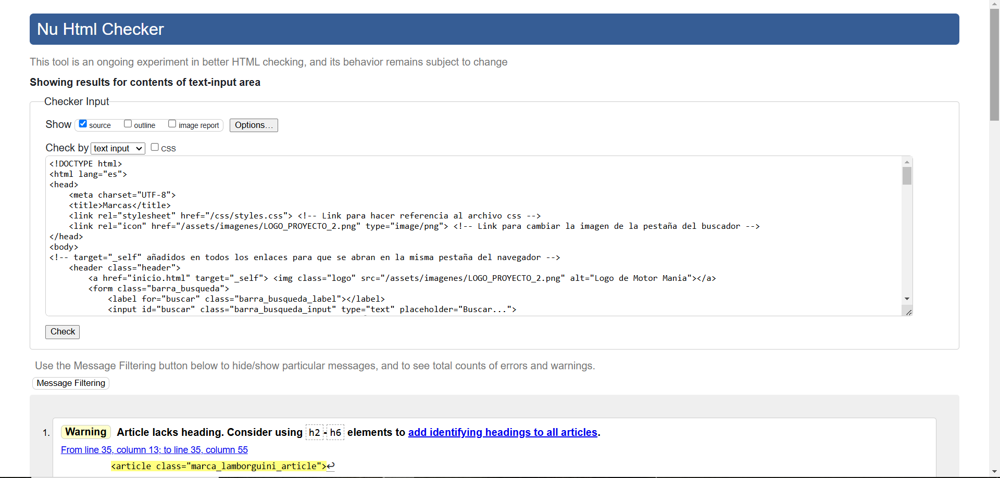
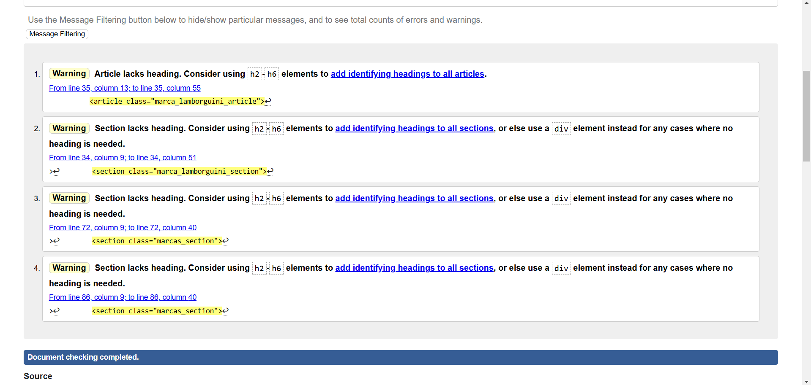

### Instrucciones para visualizar el proyecto ###
1) Clickar en el enlace al repositorio
2) Dentro del repositorio encontrarás los archivos .html y .css
3) Para visualizar la página web hay 2 opciones: 
1)Usar GitHub Pages: si el repositorio tiene habilitado GitHub Pages, puedes acceder a la página web directamente desde la URL proporcionada por GitHub, encontrarás la URL en la sección de "Settings" > "Pages" de mi repositorio.
2)Descargar los archivos y visualizarlos desde tu ordenador.
### Descripción del proyecto ###
Mi página web está formada por cuatro páginas, la página de inicio (donde hay una breve introducción y resumen de lo que puedes encontrar en la página), una página de productos (donde se venden coches), una página de contacto (donde podemos encontrar un pequeño formulario y enlace a las redes sociales) y, por último, una página de marcas, donde aparece información sobre la marca principal de la página y otras marcas colaboradoras.
### W3C VALIDATOR ###
Todo el código de mi página web ha pasado correctamente las validaciones del W3C Validator

A continuación adjunto capturas de la validación del código del archivo css:

Ahora adjunto las capturas de la validación del código de los archivos html.

Página de Inicio:

Página de Productos:

Página de Contacto:

Página de Marcas:

SELECCIONAR: por id, por clase y por query selector
COSAS QUE HACER EN LA WEB CON JAVASCRIPT:
-Seleccionar de todas las distintas formas
-Añadir una pregunta frecuente
-Eliminar un producto
-Modificar el 'contenido html' del párrafo introductorio de la página de inicio (boton)
-Modificar el 'atributo' ...... de algun div cuyo nombre no sea aclaratorio
-Modificar el tamaño y color de los botones de 'comprar'

