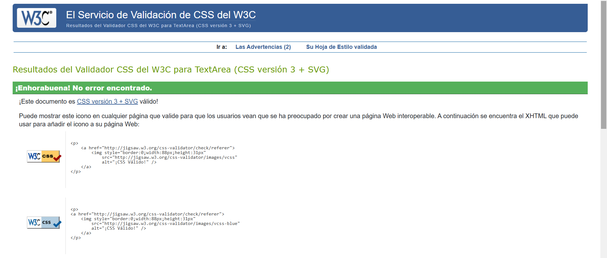
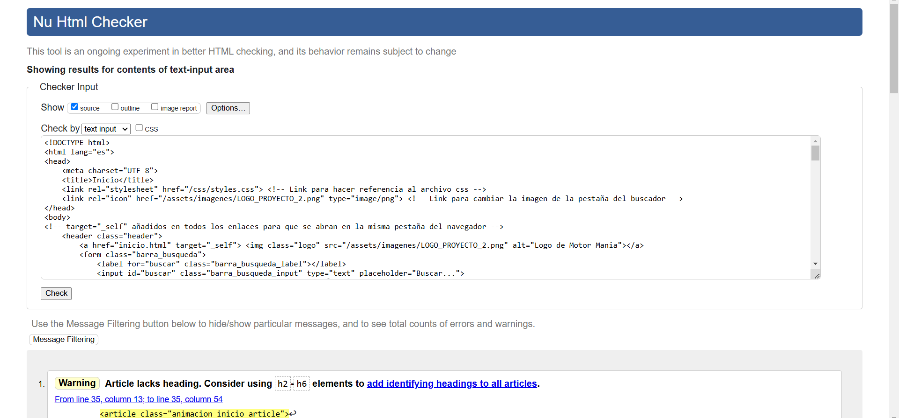
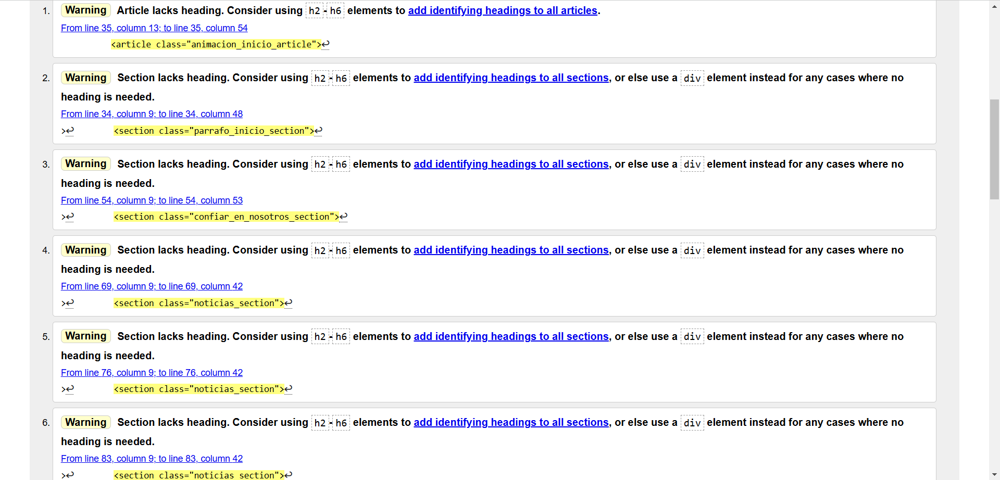
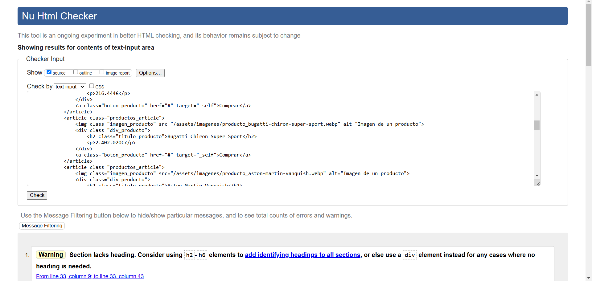
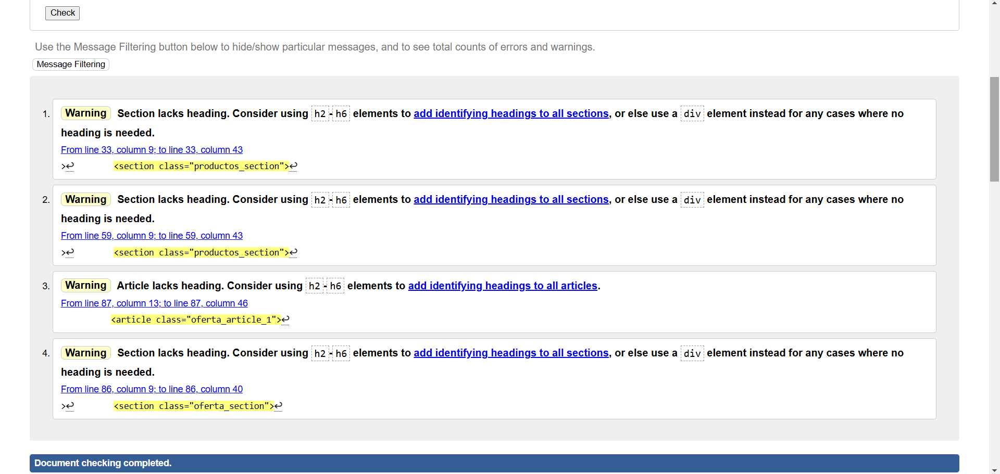
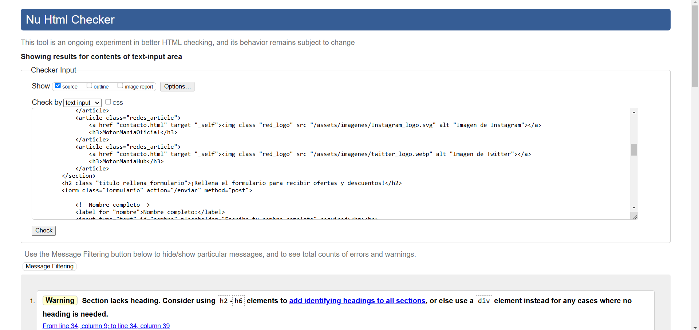
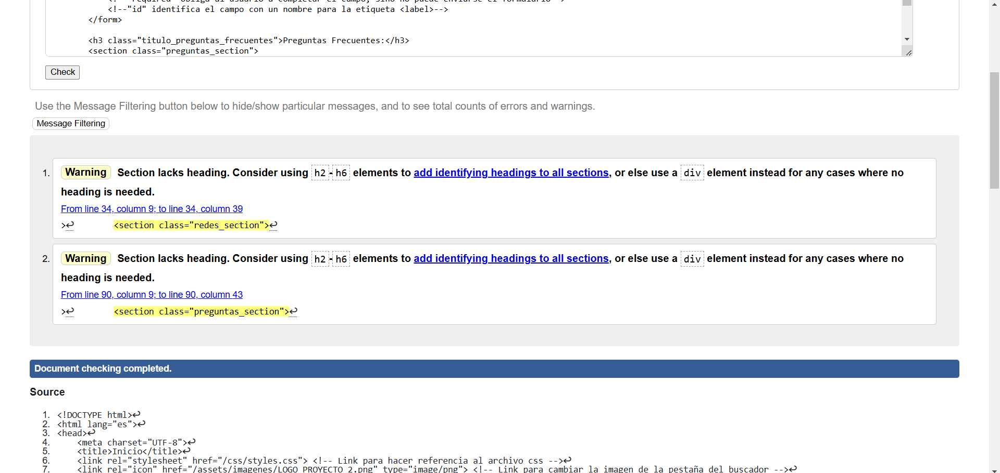
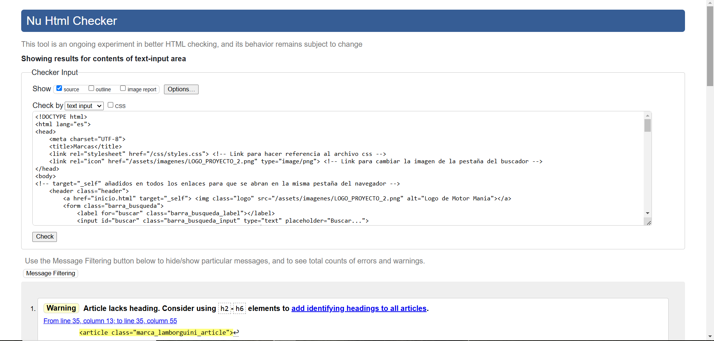
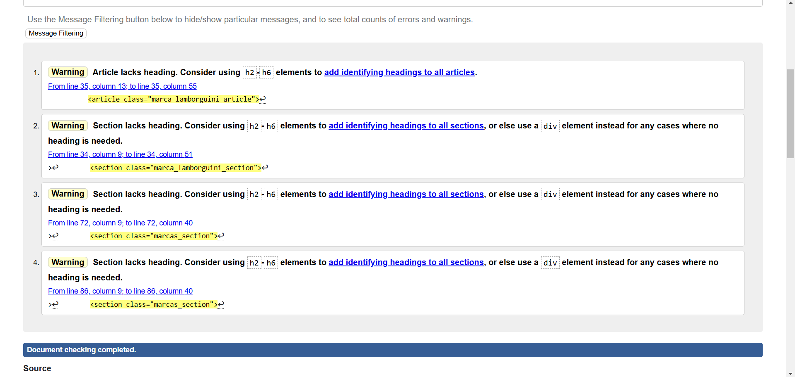

### Descripción del proyecto ###
Mi página web está formada por cuatro páginas, la página de inicio (donde hay una breve introducción y resumen de lo que puedes encontrar en la página), una página de productos (donde se venden coches), una página de contacto (donde podemos encontrar un pequeño formulario) y 
### Justificación del uso de etiquetas html ###
Cada página de las 4 tiene mínimo 3 secciones, las cuales he diferenciado con la etiqueta <section>, dentro de cada sección he diferenciado varias partes con la etiqueta <article>
### W3C VALIDATOR ###
Todo el código de mi página web ha pasado correctamente las validaciones del W3C Validator

A continuación adjunto capturas de la validación del código del archivo css:

Ahora adjunto las capturas de la validación del código de los archivos html.

Página de Inicio:

Página de Productos:

Página de Contacto:

Página de Marcas:

